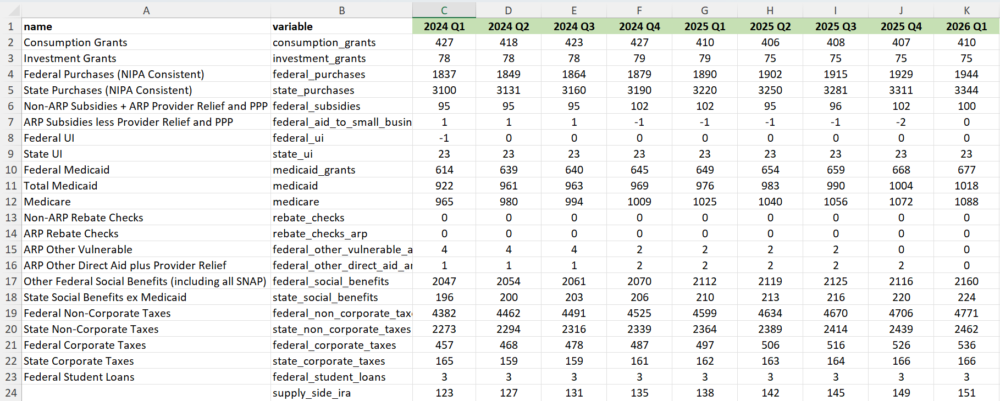

# Data Sources and Data Cleaning 

## Data Sources 

The FIM draws from several sources of data. 

### BEA's National Accounts Data 

To calculate the FIM in history, we use the national accounts data published by the U.S. Commerce Department's Bureau of Economic Analysis (BEA). Louise calls this data "the NIPAs", short for the "National Income and Product Accounts." BEA's economic statistics provide a comprehensive view of U.S. production, consumption, investment, exports, imports, income, and saving. We pull in the national accounts data from 1970 Q1 until the current quarter for our "historical" FIM calculation, meaning it is based on officially published past data as opposed to our projections for future spending. 

In January, April, July, and October, BEA releases advance estimates for GDP and its components -- a new quarter of "historical" data that we need to add to the FIM. Between these quarterly releases, BEA publishes data revisions - updates to its previously published estimates that reflect more complete and accurate information about the economy. Each month, we access this data (either a new quarter or a revision) through Haver using an R script called `data_raw/haver-pull.R`. We store the raw national accounts data in `data_raw/national_accounts.RDS`. 

We pull some of our FIM inputs straight from Haver, but sometimes we need to construct our variables. Our federal non-corporate taxes data, for example, is the sum of three separate Haver data series-- federal personal taxes, federal payroll taxes, and federal income taxes. 

**Working with Haver**

Note: Please read the Haver section of Nasiha's FIM Guide for instructions on how to set up Haver DLX on your computer. 

We run `haver-pull.R` before each FIM update to overwrite the old version of `data_raw/national_accounts.RDS` with the most recent data. As implied by the name of the script, we pull the BEA data from Haver Analytics, a paid statistical service that quickly updates and manages historical time series data-- similar to FRED. Each data series is labeled with a unique Haver code. `gs`, for example, is the Haver code for nominal state purchases. 

More specifically, we access Haver 'DLX' -- short for Data Link Express -- the software bundle that updates and provides access to the Haver databases. We refer to 'Haver' and 'DLX' interchangeably. Extensive knowledge of the inner workings of Haver is not at all required for the FIM, but understanding the basics can be helpful.

The `haver-pull.R` script relies on the Haver R package. The objects and functions in this package are designed to allow users to efficiently retrieve data from the Haver databases. The functions we use generally take as arguments specifications for databases (`@usna` and `@usecon`) and time series codes to be retrieved. 

Our `haver-pull.R` script begins with the following:

```{r r-chunk-1, echo=TRUE, eval=FALSE}
haver.path("//esdata01.brookings.edu/DLX/DATA/")
```

This important line of code sets the path to the Haver databases. In the past, we've encountered errors when BTech makes changes to how we access Haver through the research servers. If you run into insurmountable issues, I'd recommend reaching out to Valerie Wirtschafter for assistance. She worked with Manu in developing the `haver-pull.R` script. 

Although we've automated our data import process, it's sometimes helpful or necessary to look at or manually pull a data series from Haver (to inform our forecasts, to answer a Louise query, etc.). You can use the research server or the desktop Haver app to do this. When searching Haver, you must enter a Haver code followed by the database containing that series. For example, to pull nominal federal purchases search `gf@usna`, the Haver code followed by the database tag for the national accounts. There's a list of Haver codes and their corresponding variables in the data-raw folder. 

### Forecasts
Not only do we calculate the FIM in history, but also for an 8-quarter forecast period based on our projections for taxes and spending. The second data source is our forecast sheet (`data/forecast.xlsx`), which contains these projections for each of the FIM's primary inputs.



We generate forecasts based on CBO economic, budget, and revenue projections, Monthly Personal Income (MPI) data from BEA, and Louise's intuition about the future path of fiscal policy/the economy. The CBO and MPI data we use to form these forecasts is stored in the forecast sheet - inputted there manually - and is never used by this code. We access only the 'forecast', 'historical_overrides', and 'deflator_overrides' sheets contained within `data/forecast.xlsx`. The overrides are discussed below. 

Nasiha's FIM guide contains more detailed instructions on the CBO and MPI data we use to create our forecasts. 

Take some time to review everything contained in the forecast sheet - there's a ton to learn about how we form our projections, and it's best to dive right in! 

### Overrides 

**Historical Overrides**
Sometimes, we make different assumptions than BEA about how/when money was spent. We use the 'historical_overrides' sheet mentioned above to overwrite the NIPAs with our own data *in history*. These overrides are applied during the pandemic period. BEA assumes some COVID-19 related spending occurred entirely in one quarter, while we spread the spending out over multiple quarters. Also, in some cases there simply isn't a Haver series for the pandemic spending we want to include, so we need to 'overwrite' that non-existe2008.333nt data with our own. 


**Deflator Overrides**
We also use our own deflators in the projection period. Our CBO projections data (discussed below) includes forecasts for each of the variables that we need to calculate the federal, state, and consumption deflators in the future. Instead of taking these as given, however, we sometimes make changes to the deflators during our projection period based on what Louise knows/expects to happen. We make these edits in `data-raw\forecast.xlsx` in the 'deflators' sheet. The clean, final forecasts for each of our deflators is stored in the 'deflator_overrides' sheet within `forecast.xlsx`. 'deflator_overrides' is what's actually read in during our data import process. 

In practice, this means that we overwrite CBO's deflator projections for the entirety of our forecast period with whatever is in the 'deflator_overrides' sheet. Sometimes this happens to match CBO if we elect not to make edits. 

### CBO Projections 
Lastly, we use CBO projections for real potential GDP growth and GDP growth. Potential GDP growth is used in our FIM calculation, and GDP growth is used to generate GDP projections for our 8-quarter forecast period. You can access the latest CBO budget and economic data here: https://www.cbo.gov/data/budget-economic-data

CBO updates its Economic Projections and 10-Year Budget Projections every couple of months. We add these revised numbers to our forecast sheet so we can easily see CBO's estimates as we are adjusting our own forecasts. We copy and paste the CBO data into the forecast sheet by hand. 

We also store CBO's projections as an R data set in `data_raw/projections.RDS`. See Nasiha's FIM guide for instructions on how we overwrite this file when CBO publishes new projections. It's important to follow her guidelines carefully! 

`data_raw/projections.RDS` contains many variables, but as mentioned above, we only end up using real potential GDP and GDP growth. 


