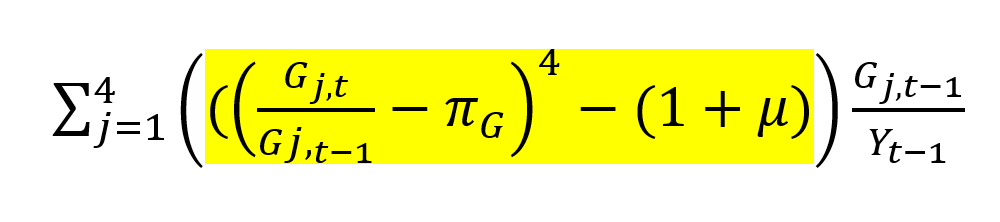
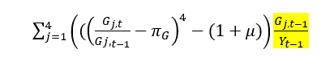
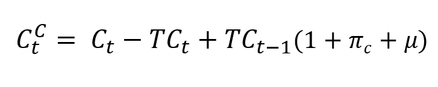

# FIM Calculation 

## Defining Input Data 
This is where we go from wrangling our data to actually calculating the FIM. 

This section of the code begins with the following: 

```{r r-chunk-9, eval=FALSE, echo=TRUE}
source("src/define_inputs.R")
```

Above, we source a helper script that selects only the `data_series` column from each of the two-column data frames that we defined previously. Later, we combine these vectors into a large data set that we export to our results folder. It's important that we keep track of and store the version of our inputs that we used to generate the results. 

Here's a section of the helper script for reference: 

```{r r-chunk-10, eval=FALSE, echo=TRUE}
federal_purchases <- federal_purchases_test$data_series
consumption_grants <- consumption_grants_test$data_series
investment_grants <- investment_grants_test$data_series
state_purchases <- state_purchases_test$data_series
```

## Defining the FIM Functions 

Next, we source a helper script called `src/contributions.R` that defines the functions we use to calculate the FIM. They execute our "FIM math" step-by-step. There is documentation of our exact methodology in the FIM folder.

In the helper script, we define several unit functions, which are the specific steps we apply to our input data to eventually generate our outputs. We also define two "wrapper functions" -- functions that bundle together our unit functions to produce our final outputs. Our outputs are the contribution of each policy category to the overall FIM. We produce a contribution for federal purchases, state purchases, and consumption (taxes and transfers). The overall FIM is simply the sum of these contributions.

Note that not all input data needs to go through all of the unit functions in order to produce the output. Specifically, the `mpc()` step can be optionally skipped.

**MPC Function** 

The first unit function is called `mpc()`: 

```{r r-chunk-11, eval=FALSE, echo=TRUE}
mpc <- function(x, mpc_matrix) {
  # Input check that the dimensions of the matrix equal the length of the series
  if (nrow(mpc_matrix) != length(x)) {
    stop("The number of rows in the mpc_matrix must equal the length of the series.")
  }
  
  # Formatting the data as a vertical column matrix is not strictly necessary;
  # but it reinforces the point that this is matrix multiplication
  vert_x <- matrix(x, ncol = 1)
  
  # ensuring proper NA handling by converting to zeroes
  # TODO: Make only the first value of NA equal to 0. Keep the other NAs as NA
  vert_x[is.na(vert_x)] <- 0
  
  # Perform matrix multiplication
  output <- mpc_matrix %*% vert_x
  
  return(output)
}
```

This function takes a time series and an MPC matrix as its inputs. Our MPCs are stored in the `cache` folder. This documentation book contains a separate MPC chapter explaining in depth our MPCs and the process we use to apply them. 

The `mpc()` function first calls `x` (the data) and the appropriate `mpc_matrix` - an RDS file containing our MPCs. Our MPCs are cached, meaning we never overwrite or regenerate them in this code. This saves us significant processing time.

Next, the function checks to ensure the dimensions of the matrix are equal to the length of the data series. Everything should be 259 entries in length (enough rows to store data from 1970 Q1 until 2034 Q3). For RAs working on the FIM in 2032, you will need to extend the MPC matrices and our data frame inputs to accommodate more quarters. Please see the MPC section for documentation on how we create these MPC matrices. 

We then format the data (`x`) as a vertical column matrix and coerce all NAs to zero. We define an object called output, which is the `mpc_matrix` multiplied by the vector of data. The function ultimately returns a numeric vector representing the post-MPC data. 
Again, please see the MPC section for further explanation of our MPCs. 

We do not apply MPCs to federal purchases, state purchases, investment grants, and consumption grants. This data already measures the direct effects of government spending on output. Our supply side IRA series (included as taxes) also does not have an MPC. "Supply side IRA" is construction spending on manufacturing facilities and equipment related to the IRA and CHIPs, which like federal and state purchases, we assume has an instantaneous effect on GDP. The implied MPC is 1 since "supply side IRA" already represents a direct estimate of how much legislation increased manufacturing output. 

We apply MPCs when we do believe that the effect of a cash flow on GDP is not immediate. For example, unemployment benefits might be received in quarter 1, but not spent until quarter 2. And some of the initial disbursement might be saved permanently. Thus, MPCs capture the timing effects of taxes and transfers on GDP as well as the fact that these polices may not have a 1:1 effect on output. 

*So what gets an MPC?* 

In summary, we apply MPCs to all of our tax and transfer policies except for supply side IRA. We do not apply MPCs to purchases or grants.

**Purchases FIM Function**

Next, the `contributions.R` helper script defines two unit functions to calculate the FIM for purchases. 

The first function is the following: 

```{r r-chunk-12, eval=FALSE, echo=TRUE}
minus_neutral_purchases <- function(x, # the data in question
                          rpgg, # real potential gdp growth,
                          dg # consumption deflator growth
) {
  output <- (x/lag(x) - dg)^4 - (1+rpgg)
  return(output)
}
```

`minus_neutral_purchases()` is the heart of our FIM calculation. We get the quarterly growth in purchases (minus inflation and then annualized) and subtract out the annualized growth rate of real potential GDP. In other words, we're getting the extent to which growth in purchases was above or below growth in potential. 

The function has three inputs: 
*`x`, our data 
*`rpgg`, real potential GDP growth (we input an annualized rate)
*`dg` deflator growth (at a quarterly rate)

`minus_neutral_purchases()` executes the highlighted part of the following equation (from our FIM methodology document):




Next, we define our `scale_to_gdp()` function: 

```{r r-chunk-13, eval=FALSE, echo=TRUE}
scale_to_gdp_purchases <- function(x, # the data in question, 
                         gdp, # GDP
                         result)
{
  output = 100*result*(lag(x)/lag(gdp))
  return(output)
}
```

We multiply the result of our minus neutral calculation by the share of purchases in GDP in the preceding quarter. `scale_to_gdp_purchases()` executes the highlighted portion of the formula below: 



Lastly, we define a wrapper function `contribution_purchases()` that bundles the two unit functions together to produce the contribution of purchases to the overall FIM. See below: 

```{r r-chunk-14, eval=FALSE, echo=TRUE}
contribution_purchases <- function(
    x, # our data series 
    rpgg, # real potential GDP growth
    dg, # deflator growth
    gdp #gdp
    ) {
  
  # Actual Growth Minus Counterfactual Growth
  result <- minus_neutral_purchases(x = x, rpgg = rpgg, dg = dg)
  
  # Apply Scale to GDP Function
  output <- scale_to_gdp_purchases(x = x, result =result, gdp = gdp)
  return(output)
}
```

There is no MPC argument as we do not apply MPCs to purchases. 

**Taxes and Transfers** 

First, it's important to be clear on the following: when we say "impulse from transfers and taxes", we mean the post-MPC data -- the dollars from the policy that actually turned into consumption each quarter. 

We calculate the FIM for net transfers a bit differently than we do for purchases. So let's dive into our unit functions for consumption: 

First, we define `t_counterfactual()`, which as the name suggests, defines our counterfactual consumption -- the level of consumption that would have prevailed if the impulse from taxes and transfers grew at the rate of potential GDP. 

Counterfactual consumption is equal to actual personal consumption expenditures less the consumption impulse from policy (the post-MPC data) plus the lagged impulse grown with real potential GDP and the PCE deflator. To simplify, we get actual consumption, subtract out the actual policy impulse, and replace it with a counterfactual policy impulse (what the policy impulse would have been if it grew at potential). The result is counterfactual consumption: what consumption would have been under this Hutchins-constructed policy impulse rather than the actual one. 

See below: 
```{r r-chunk-15, eval=FALSE, echo=TRUE}
t_counterfactual <- function(x,  # Our data series 
                             c, # Personal Consumption Expenditures
                             rpgg, # Real Potential GDP Growth (quarterly)
                             dg # Deflator Growth (quarterly)
) {
  
  
  counterfactual <- as.numeric(c - x + lag(x)*(1+rpgg+dg))
  return(counterfactual)
}
```

`t_counterfactual()` has several inputs: 

- `x`, the sum of all of our post-MPC taxes and transfers series 
- `c`, personal consumption expenditures (from BEA)
- `rpgg`, real potential GDP growth, at a quarterly rate
- `dg`, consumption deflator growth, at a quarterly rate. 

Note: We need to convert our results to a numeric object. Sometimes, instead of using the sum of all of our post-MPC taxes and transfers, we input an individual post-MPC policy data series as `x` (`post-mpc-federal-subsidies`, for example). See the 'Economics Methodology' section for further explanation of how/why we do this.  These post-MPC objects are matrices, so we need to convert the result to numeric so it can be further processed by the functions below. 

The function above executes the following part of our FIM math: 


Our second unit function is `minus_neutral_t()`, the heart of our FIM calculation for transfers!

```{r r-chunk-16, eval=FALSE, echo=TRUE}
minus_neutral_t <- function(c, # BEA Consumption
                            counterfactual # The counterfactual we defined above
) {
  minus_neutral <- (c/lag(c))^4 - (counterfactual/lag(c))^4 
  return(minus_neutral)
}
```

Minus neutral is actual growth in consumption minus growth in counterfactual consumption (relative to last quarter's actual consumption). Both growth rates are annualized. 

`minus_neutral_t()` executes the highlighted portion of our net transfers FIM math: 


Next, we scale to GDP: 

```{r r-chunk-17, eval=FALSE, echo=TRUE}
scale_to_gdp_t <- function(minus_neutral, # minus_neural, which we defined above
                           gdp, # GDP
                           c # Consumption
) {
  result <- 100*minus_neutral*(lag(c)/lag(gdp))
  return(result)
}
```

`scale_to_gdp_t()`executes the portion of our net transfers FIM math highlighted below: 


Lastly, we define a wrapper function called `contribution_transfers()` that bundles the three functions above: 
```{r r-chunk-18, eval=FALSE, echo=TRUE}
contribution_transfers <- function(x, # our data
                                   c, # consumption 
                                   rpgg, # real potential GDP growth
                                   dg, # deflator growth
                                   gdp # gdp 
                                   ) {
  
  # Define Counterfactual
  counterfactual <- as.numeric(c - x + lag(x) * (1 + rpgg + dg))
  
  # Define Minus Neutral
  minus_neutral <- (c / lag(c))^4 - (counterfactual / lag(c))^4
  
  # Scale to GDP
  output <- 100 * minus_neutral * (lag(c) / lag(gdp))
  
  return(output)
}

```


## Applying Our MPCs

Now that we've defined each of our functions, let's move on to applying our MPCS so we can calculate the FIM. d

First, we use the `mpc()` function to apply MPCs to our taxes data. As discussed above, we take our data `x` and an MPC matrix as our inputs.  

```{r section-C.1-apply-taxes-mpcs, eval=FALSE, echo=TRUE}
# This code block prints the chunk entitled "section-C.4-apply-taxes-mpcs" 
# from fiscal_impact_BETA.R
```

Next, we use the `mpc()` function to apply our MPCs to our tranfsers data: 

```{r section-C.2-apply-transfers-mpcs, eval=FALSE, echo=TRUE}
# This code block prints the chunk entitled "section-C.2-apply-transfers-mpcs" 
# from fiscal_impact_BETA.R
```

Now, we create net transfers by summing the post-MPC data. We also create "FIM state purchases." See the section below for an explanation of what this is. 
```{r section-C.3-create-net-transfers, eval=FALSE, echo=TRUE}
# This code block prints the chunk entitled "section-C.3-create-net-transfers" 
# from fiscal_impact_BETA.R
```

## Calculating the FIM

### Purchases FIM 

In the national accounts data, the BEA allocates federal grants to state and local governments to the "state purchases" data series.  We want to more accurately allocate this spending to the level of government that actually financed the purchases. Therefore, when we calculate the FIM for purchases, we need to reassign some spending by state and local governments to its actual source -- the federal government. 

A common distinction in the FIM lexicon is "NIPA consistent purchases" and "FIM consistent purchases." "NIPA purchases" describes purchases as they are allocated by BEA. FIM purchases reflect our version of purchases, with consumption and investment grants to states reassigned to the federal government. 

Above, we calculated our data for FIM state purchases -- NIPA state purchases minus consumption and investment grants. We calculate the FIM for "FIM consistent state purchases" in the section below. `fim_state_purchases_test()` is our data input, reflecting state purchases without the purchases funded by the federal government. 

To get the FIM for "FIM consistent federal purchases" we first calculate the FIM for total NIPA purchases. Then we subtract out the FIM for "FIM consistent state purchases." The result is the FIM for "FIM consistent federal purchases." 

```{r section-C.4-calculate-purchases-fim, eval=FALSE, echo=TRUE}
# This code block prints the chunk entitled "section-C.4-calculate-purchases-fim" 
# from fiscal_impact_BETA.R
```

We use the `contribution_purchases()` wrapper function to execute all of our steps at once. It's important to keep track of which growth rates are annualized and which are not. I'd recommend reviewing our FIM math document as well as the `contributions.R` helper script if you are confused by any parts of the FIM calculation. 

### Net Transfers FIM 
 
Next, we calculate the FIM for net transfers by simply applying our `contribution_transfers()` wrapper function. Our data input is `taxes_transfers_test$data_series`, the sum of our post-MPC taxes and transfers. 

We also estimate the FIM for each specific tax or transfer program. Instead of plugging in the sum of our post-mpc taxes and transfers, we plug in the post-mpc data for an individual policy -- `post_mpc_federal_subsidies`, for example. By doing this, we're looking at the difference between the actual growth in consumption (which includes the actual impulse from that specific policy) and counterfactual consumption (which instead includes our constructed policy impulse - last quarter grown at potential). The result is an estimation of the contribution of that specific policy to the overall FIM. This is exactly the same math as what we apply to the net transfers sum. If we add each of these contributions, we will get close to our result using `taxes_transfers_test$data_series` as an input. Small differences arise because in *version 1*, we sum the net transfers data, calculate the FIM, and then annualize, whereas in version 2, we calculate the FIM, annualize, and then sum the components.

Below, we calculate the contribution for the net transfers sum as well as the individual components. 

```{r section-C.5-calculate-net-transfers-FIM, eval=FALSE, echo=TRUE}
# This code block prints the chunk entitled "section-C.4-calculate-purchases-fim" 
# from fiscal_impact_BETA.R
```


In this next chunk of code, we calculate the overall FIM, which is the sum of our contributions. We also calculate the four-quarter moving average. 

```{r section-C.6-aggregate-FIM-contributions, eval=FALSE, echo=TRUE}
# This code block prints the chunk entitled "section-C.4-calculate-purchases-fim" 
# from fiscal_impact_BETA.R
```

## Outputting Results 
If you recall, in some of the first lines of this script, we defined a bunch of empty folders that will store our FIM results. Now it's time to export our results to those directories. 

There are three main objectives we accomplish in this section: 

1. We store our inputs and outputs as Excel sheets. We often review this data with Louise. We also sometimes need this data in later months when we want to compare our results with a prior publication. 
2. We generate the materials that are needed to publish the FIM on the Brookings website. This includes a .csv file that populates the interactive graph on the FIM webpage and the pdf document displaying a static image of the FIM that is also available on the website. 
3. We create the so-called "Manu file", an R markdown file with nicely formatted graphs and tables. This is the main document that we show Louise when we're reviewing our results. The "Manu file" uses the previously mentioned Excel sheets to retrieve our results data.  

In the chunk of code below, we create two data frames (inputs and outputs) and then store them in the results folder. 

NOTE: Currently, we store everything in a "beta" version of our results (i.e. `results//{month_year}/beta/`). This is a hold over from Lorae's work refactoring Manu's original FIM code. This should eventually be corrected.  

```{r section-C.7-output-results, eval=FALSE, echo=TRUE}

# Displays code from C.7 

```

### Generating Web Materials 

In this final section, we generate the materials needed to publish our results on the Brookings website. Nasiha's FIM guide contains detailed instructions on how to update the FIM page. 

First, we generate our 'interactive' data frame - the data we use to make the interactive graph on the webpage. WordPress has custom HTML text that is prepared to handle a very specific data set, so it is critical that you DO NOT CHANGE this section.

```{r r-chunk-19, eval=FALSE, echo=TRUE}
# Generate interactive data frame from contributions
interactive <- contributions_df %>% 
  # Filter rows of contributions by date, keeping only those between 1999 Q4 and
  # current quarter + 8
  filter_index('1999 Q4' ~ as.character(current_quarter + 8)) %>% 
  # Select only specific columns
  select(date, 
         impact = fiscal_impact_4q_ma,
         recession,
         total = fiscal_impact_measure,
         federal = federal_contribution,
         state_local = state_contribution,
         consumption = consumption_contribution,
         projection = id
  ) %>% 
  # Recode `recession` and `projection` variables to 0 and 1 binaries
  mutate(recession = recode(recession, `-1` = 0),
         recession = replace_na(recession, 0),
         projection = recode(projection, historical = 0, projection = 1)
  ) %>%
  # Split date column into year and quarter columns
  separate(date, c('year', 'quarter'))

# Write interactive data frame to CSV file
readr::write_csv(interactive,  file = glue('results/{month_year}/beta/interactive-{month_year}.csv'))

```

Next, we create the static image of the FIM that we upload as a pdf to the website. Note that this section of the code generates an html file. We open this file and save it as a pdf manually. 
```{r r-chunk-20, eval=FALSE, echo=TRUE}
rmarkdown::render('Fiscal-Impact.Rmd',
                  # Render R Markdown document to PDF file
                  output_file = 'Fiscal-Impact.html',
                  clean = TRUE,
                  params = list(start = yearquarter('1999 Q4'), end = current_quarter + 8))

# Copy FIM/Fiscal-Impact.html graphs to the results/month-year/beta folder
file_copy(path = 'Fiscal-Impact.html',
          new_path = glue('results/{month_year}/beta/Fiscal-Impact-{month_year}.html'),
          overwrite = TRUE)

```

Lastly, we create the previously mentioned "Manu file". 
TO DO: add documentation on the Manu file once it's done. 

```{r r-chunk-21, eval=FALSE, echo=TRUE}
source("scripts/index_temp.R")

rmarkdown::render(input = 'update-comparison-markdown.Rmd',
                  output_file = glue('results/{month_year}/beta/update-comparison-{month_year}'),
                  clean = TRUE)

```