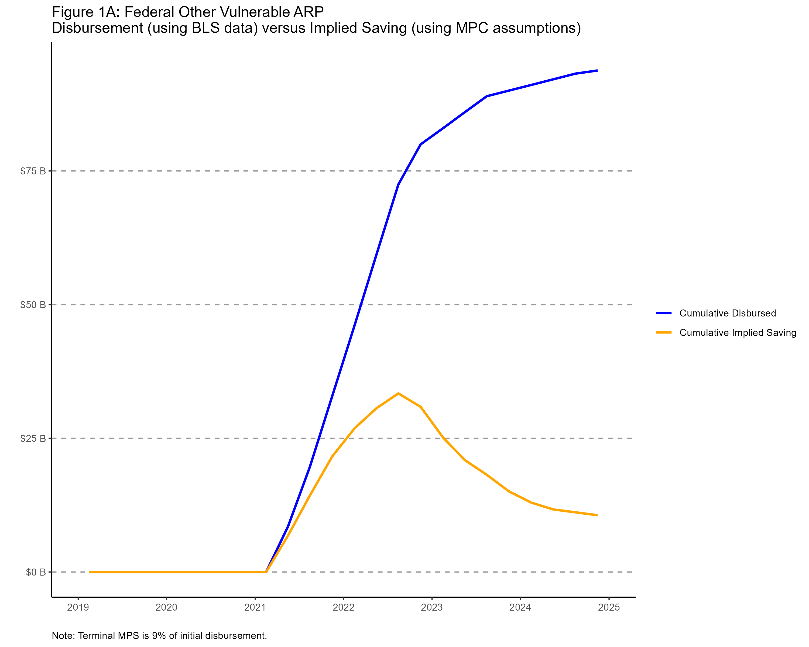

```{r setup, include=FALSE}
knitr::opts_chunk$set(echo = TRUE)
```

## Notes for running
Run this Rmd file only after running mps_calculations.R in the FIM > mpc_multiplier_THP_hutchins folder.

## Current FIM MPCs

The FIM assumes MPCs based on the category of spending. We can use those to produce plots like the ones below.

#### Figure 1A: Cumulative savings from Federal Other Vulnerable ARP

#### Figure 1B: Cumulative savings from Federal Other Vulnerable ARP
You can also embed plots, for example:

```{r pressure, echo=FALSE}
plot(pressure)
```

Note that the `echo = FALSE` parameter was added to the code chunk to prevent printing of the R code that generated the plot.
